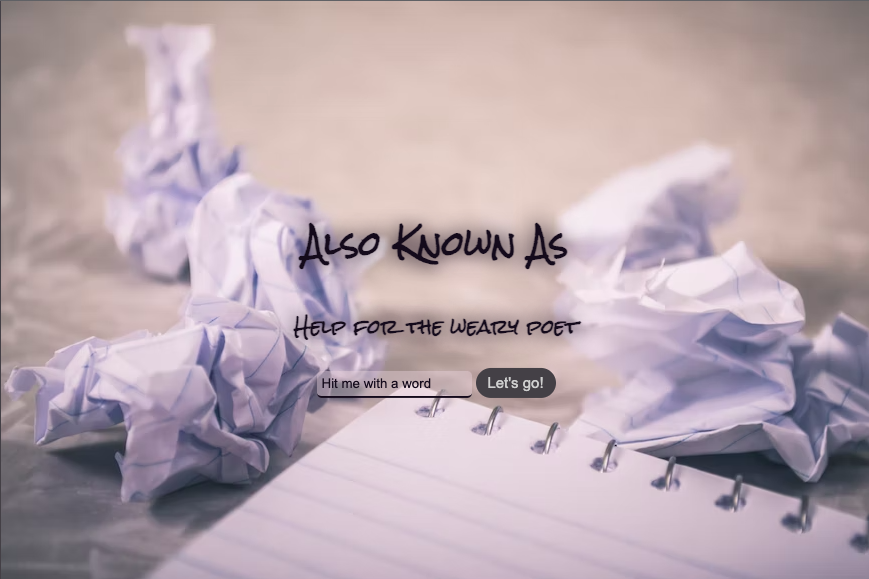
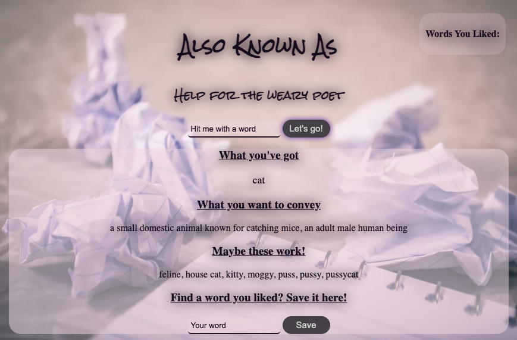

# Also Known As

A tool to help writers find inspiration using the Merriam Webster Thesauraus API

## Technologies Used
- CSS
- Javascript
- jQuery
- HTML
- The Collegiate® Thesaurus API

## Screenshots

## Getting Started

[Click Here](https://sjlelait.github.io/also-known-as/) to see the deployed app!

- Ability to save liked words
- Local storage for list
- Mobile first design

